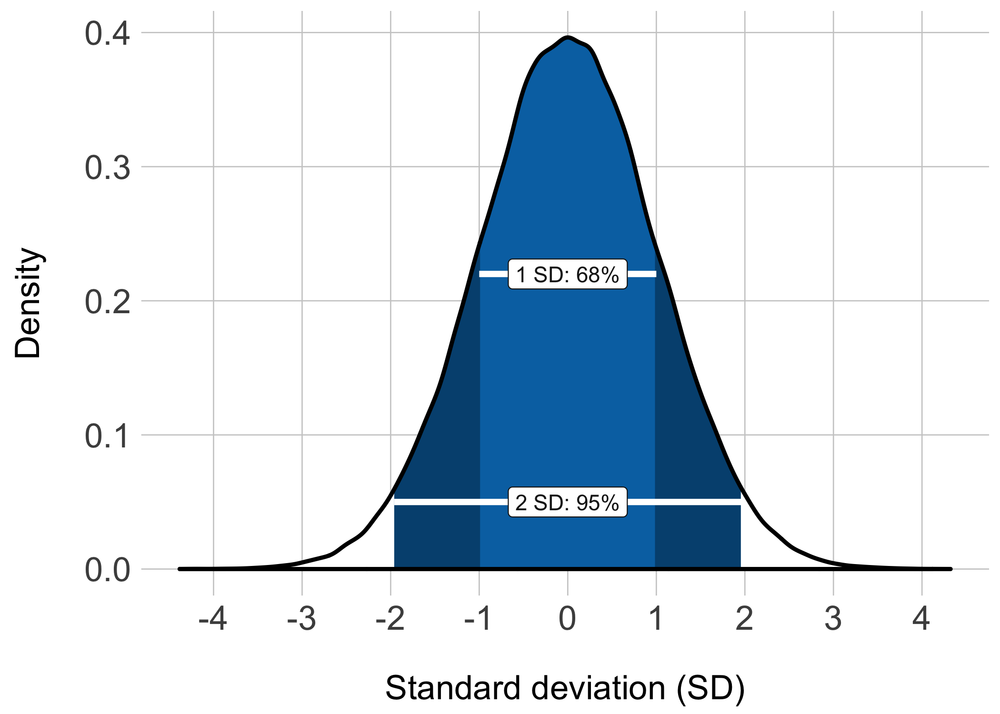
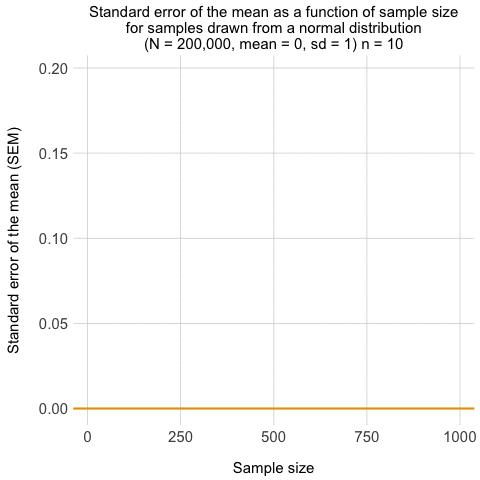
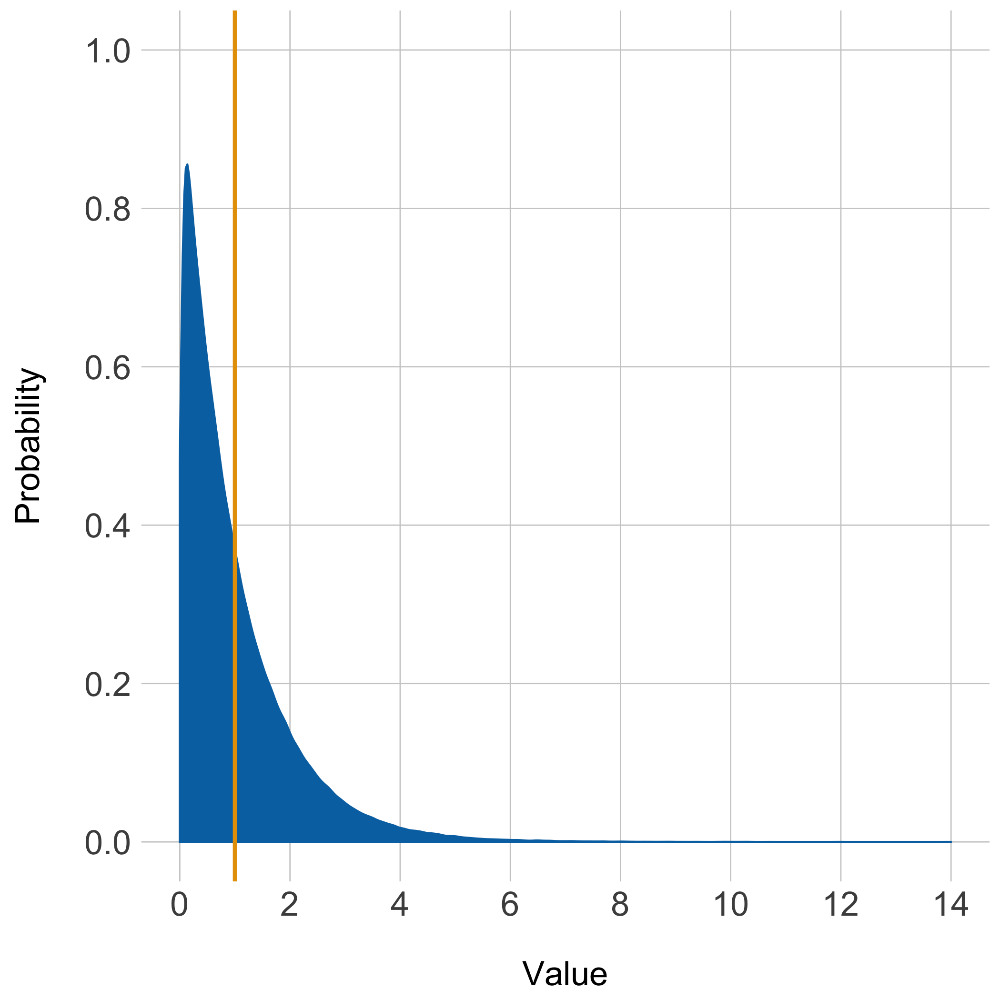
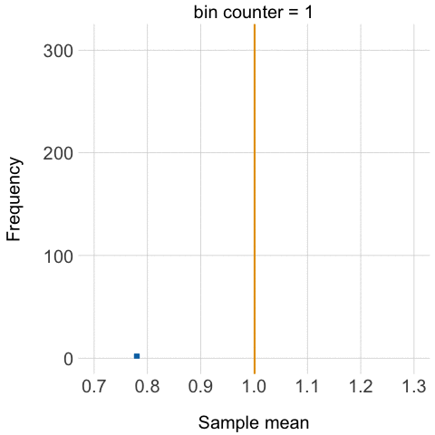
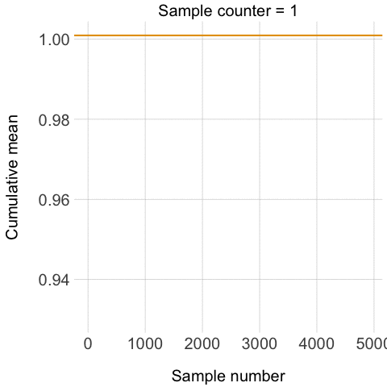

****

#### System setup
_Click **'code'** on the left to view the [R](//cran.r-project.org/) setup._ 
```{r setup, warning = FALSE, message = FALSE, tidy = FALSE}
# Load packages
library(dplyr)
library(tidyr)
library(ggplot2)
library(gganimate)
library(knitr)

# set seed
set.seed(123)

# knitr chunk options
opts_chunk$set(echo = TRUE,
               eval = TRUE,
               include = TRUE,
               warning = FALSE,
               message = FALSE,
               cache = TRUE,
               cache.extra = rand_seed,
               fig.width = 7,
               fig.height = 7,
               tidy = FALSE)
```

****

## Background
_Click **'code'** on the left to show the code used to generate the figures in this section._

I have wanted to try David Robinson's (@drob) [gganimate](//github.com/dgrtwo/gganimate) package since I came across it a few months ago. The package extends Hadley Wickham's (@hadleywickham) [ggplot2](//github.com/hadley/ggplot2) package by adding a _'frame'_ aesthetic that provides a time factor to geoms, allowing them to be animated. 

Recently, the opportunity for me to put the package through its paces came while I was preparing materials for an [introductory biostatistics](//painblogr.org/biostatistics/) tutorial for undergrad students. I wanted to demonstrate the _central limit theorem_ and _law of large numbers_, and thought that animations would help deliver the message. 

The central limit theorem provides a shortcut to knowing the sampling distribution, which is the probability distribution of a statistic (e.g., mean, proportion) for all possible samples from a population. The theorem is one of the cornerstones of probability theory because it allows you to make statements about the sampling distribution for a particular statistic without having to sample the entire population. As such, it forms the basis of statistical inference.

The central limit theorem states that the sampling distribution of an independent, random variable is normal or near-normal if a sufficiently large number of (equal-sized) samples are taken. If the sampling distribution for a statistic follows a normal or near-normal distribution we can make probability statements about the range of values in which the statistic lies. For example, there is a 68% probability that the sample statistic is within 1 standard deviation of the population value, and a 95% probability that it lies within about 2 standard deviations (see figure below). In the case of the sampling distribution, the standard deviation of the distribution is also called the _standard error_. 

```{r normal_dist}
# Generate formal distribution of mean = 0, sd = 1
norm.df <- rnorm(200000, mean = 0, sd = 1) %>%
    data_frame(values = .)

# Calculate density from norm.df
norm.dens <- density(norm.df$values)
norm.dens <- data_frame(x = norm.dens$x, y = norm.dens$y)

# Calculate quantiles from norm.df
q2.5 <- quantile(norm.df$values, 0.025)
q97.5 <- quantile(norm.df$values, 0.975)
q16 <- quantile(norm.df$values, 0.16)
q84 <- quantile(norm.df$values, 0.84)

# Use quantiles to filter data for geom_ribbon
dens_95 <- norm.dens %>%
    filter(x > q2.5 & x < q97.5) %>%
    mutate(quant = rep('2SD', length(x)))
dens_68 <- norm.dens %>%
    filter(x > q16 & x < q84) %>%
    mutate(quant = rep('1SD', length(x)))
ribbon <- do.call(rbind, list(dens_95, dens_68))

# Plots
norm.plot <- ggplot() +
    geom_density(data = norm.df, aes(x = values),
                 fill = '#FFFFFF') +
    geom_ribbon(data = ribbon[ribbon$quant == '2SD', ],
                              aes(x = x, ymax = y, ymin = 0), 
                fill = '#00517f') +
    geom_ribbon(data = ribbon[ribbon$quant == '1SD', ],
                              aes(x = x, ymax = y, ymin = 0),
                fill = '#0072B2') +
    geom_density(data = norm.df, aes(x = values),
                 size = 1) +
    geom_segment(aes(x = -1, xend = 1,
                     y = 0.22, yend = 0.22), 
               colour = "#FFFFFF", size = 1.5) +
    geom_label(aes(label = '1 SD: 68%', x = 0, y = 0.22), 
              colour = 'gray10', fill = '#FFFFFF') +
    geom_segment(aes(x = -1.96, xend = 1.96,
                     y = 0.05, yend = 0.05), 
               colour = "#FFFFFF", size = 1.5) +
    geom_label(aes(label = '2 SD: 95%', x = 0, y = 0.05), 
              colour = 'gray10', fill = '#FFFFFF') +
    scale_x_continuous(breaks = seq(from = -4, to = 4, by = 1)) +
    labs(x = '\nStandard deviation (SD)', y = 'Density\n') +
    theme(plot.title = element_text(size = 17), 
          axis.text = element_text(size = 17),
          axis.title = element_text(size = 17),
          axis.ticks = element_blank(),
          panel.grid.major = element_line(colour = 'gray80', size = 0.3),
          panel.background = element_blank())
# Save plot
ggsave('normal-distr.png', norm.plot, width = 7, height = 5)
```

<!-- Use html to allow control over plot dimensions (480 x 480px) -->
 

The size of the standard error also allows us to gauge the precision of the sample statistic, and this _'width'_ of the sampling distribution is dependent on the size of the samples. From a technical point of view, the standard error of the sample statistic is equal to the standard deviation of the population divided by the square root of the sample size ($se = \frac{\sigma}{\sqrt{n}}$). Basically, as the size of each sample increases the samples are more likely to be representative of the population, and therefore variability around the point estimate should decrease. The figure below shows the effect of increasing sample size on the precision of the standard error. 

```{r precision}
# Generate data (6 samples from a normal distribution: mean = 0, sd = 1)
prec_data <- rnorm(200000, mean = 0, sd = 1)
foo <- list() # empty list
bar <- seq(from = 10, to = 1000, by = 20) # sample sizes
for(i in 1:50) {
    foo[[i]] <- sample(prec_data, bar[i])
    foo <- lapply(foo, data.frame)
    df.name <- seq(from = 10, to = 1000, by = 20)
    names(foo[[i]]) <- df.name[i]
    foo
}

# Clean-up data for plotting
baz <- foo %>%
    rbind_all() %>%
    gather(key, value) %>%
    filter(!is.na(value)) %>%
    group_by(key) %>%
    summarise(n = length(value),
              sem = sd(value) / sqrt(sum(1:length(key)))) %>%
    select(n, sem) %>%
    arrange(n)

# Plot data
prec.plot <- ggplot(data = baz, aes(y = sem, x = n, 
                                    frame = n)) +
    geom_line(aes(cumulative = TRUE), 
              colour = '#0072B2', size = 1) +
    geom_hline(yintercept = 0, 
               colour = "#E69F00", size = 1) +
    labs(title = 'Standard error of the mean as a function of sample size\nfor samples drawn from a normal distribution\n(N = 200,000, mean = 0, sd = 1) n =',
         x = '\nSample size', y = 'Standard error of the mean (SEM)\n') +
    theme(plot.title = element_text(size = 15), 
          axis.text = element_text(size = 15),
          axis.title = element_text(size = 15),
          axis.ticks = element_blank(),
          panel.grid.major = element_line(colour = 'gray80', size = 0.3),
          panel.background = element_blank())

# Save plot
gg_animate(prec.plot, interval = 0.2, 'sem.gif')
```



This leads us to the _law of large numbers_. At a simplistic level, the central limit theorem tells us about the shape of the sampling distribution, while the law of large numbers tells us where the centre of the distribution lies. From the law of large numbers we can show that the cumulative result from a large number of trials/samples tends towards the true value in the population. That is, the probability of an unusual outcome becomes smaller as the number of trials/samples increases This convergence in probability is also called the _Weak law of large numbers_. 

## gganimate: the theories in action

In this section I use the _gg\_animate_ function from the _gganimate_ package to put the two theories into action.

****

#### Generating the data
_Click **'code'** on the left to show the code used to generate all data used in this section._
```{r generate_data}
# Create empty objects, counter, and right-skewed data
foo <- rexp(200000)
bar <- list()
cnt <- 1:5000

# Take 5000 samples of n = 200 from 'data' and make a list of sample means.
for(i in cnt){
    bar[[i]] <- mean(sample(foo, size = 200))
}

#######################
# Central limit theorem

# Unlist and round to reduce the number of bins for CLT
baz <- round(unlist(bar), 2)

# cross-tabulate the data
boo <- xtabs(~baz)

# Extract the names ('bins')
nam <- names(boo)

# Make data.frame for plotting
bee <- data_frame(sample = c(1:length(boo)),
                  mean = as.numeric(nam),
                  freq = as.numeric(boo))

######################
# Law of large numbers 

# Unlist for LLN
baz_2 <- unlist(bar)

# Calculate cummulative mean for plotting
zoot <- baz_2 %>%
    data_frame(mean = .) %>%
    mutate(cmean = round(cummean(mean),4),
           count = 1:length(mean)) %>%
    select(count, mean, cmean)
```

****

### Our population
_Click **'code'** on the left to view the plot code._

The central limit theorem holds across different distributions, and to  illustrate tgis point I have started with a population generated by taking a random sample (_N_ = 200,000) from the exponential distribution (right-skewed) with rate 1. The density distribution of this dataset (with its mean) is shown in the figure below, and it served as the population from which samples were taken to demonstrate the central limit theorem and the law of large numbers. 

```{r original_plot}
# Create df from original data for plotting
distr <- data_frame(data = foo)

# Plot original distribution
distr.plot <- ggplot(distr, aes(data)) +
    geom_density(fill = '#0072B2', colour = '#0072B2') +
    geom_vline(xintercept = mean(foo), colour = "#E69F00", size = 1) +
    scale_x_continuous(limits = c(0, 14),
                       breaks = c(0, 2, 4, 6, 8, 10, 12, 14)) +
    scale_y_continuous(limits = c(0, 1),
                       breaks = c(0, 0.2, 0.4, 0.6, 0.8, 1)) +
    labs(x = '\nValue', y = 'Probability\n') +
    theme(plot.title = element_text(size = 17), 
          axis.text = element_text(size = 17),
          axis.title = element_text(size = 17),
          axis.ticks = element_blank(),
          panel.grid.major = element_line(colour = 'gray80', size = 0.3),
          panel.background = element_blank())

# Save plot
ggsave('original-distr.png', distr.plot)
```

<!-- Use html to allow control over plot dimensions (480 x 480px) -->
 

### The central limit theorem in action
_Click **'code'** on the left to view the code used to generate the plot._  

To demonstrate the central limit theorem, I took 5000 samples (without replacement), each of 200 from the 'population' of 200,000, and calculated the mean for each sample (_find the code used to generate the data [here](#generating-the-data)_). I then tabulated the frequency at which sample means occurred across the 5000 samples, and used these data to plot a frequency histogram. However, in addition to the usual code I'd use to generate the ggplot2 plot, I added the gganimate aesthetic functions (**'frame'** and **'cumulative'**) to the geom\_bar aesthetics. Adding these new aesthetics allowed the gg_animate function to take the ggplot2 object and to sequentially add the frequency bins of sample means as frames in an animation ('frame'), and for each frame to built cumulatively on the previous one ('cumulative = TRUE').  

The output is shown in the next figure, and as you can see, despite the samples being obtained from a right-skewed distribution, the distribution of sample means is roughly normal, and centred around the mean of the population. 

```{r clt_plot}
# Plot CLT data
clt <- ggplot(bee, aes(y = freq, x = mean, frame = sample)) +
    geom_bar(aes(cumulative = TRUE), stat = 'identity',
             fill = '#0072B2', colour = '#0072B2') +
    geom_vline(xintercept = mean(foo), colour = "#E69F00", size = 1) +
    scale_x_continuous(limits = c(0.7, 1.3),
                       breaks = seq(from = 0.7, to = 1.3, by = 0.1)) +
    labs(title = 'bin counter =',
         x = '\nSample mean', y = 'Frequency\n') +
    theme(plot.title = element_text(size = 20),
          axis.text = element_text(size = 20),
          axis.title = element_text(size = 20),
          axis.ticks = element_blank(),
          panel.grid.major = element_line(colour = 'gray80', size = 0.3),
          panel.background = element_blank())

# Animate plots
gg_animate(clt, interval = 0.2, 'central-limit.gif')
```



### The law of large numbers in action
_Click **'code'** on the left to view the code used to generate the plot._

To illustrate the law of large numbers, I took the 5000 sample means I had generated and calculated a cumulative mean across the samples (_find the code used to generate the data [here](#generating-the-data)_). The cumulative mean was then plotted against the sample number in ggplot2, with the gganimate **'frame'** and **'cumulative'** aesthetics added to geom\_line, which allowed gg_animate to depict the changing cumulative mean across increasing sample number as frames in the animation. 

The resulting figure is shown below, and shows the cumulative mean of sample means getting closer to the population mean as the number of samples increases. 

```{r lln_plot}
# Trim the data to roughly equal the number of frames in the CLT plot
bee_length <- dim(bee)[1]
sample_freq <- length(zoot$count)/bee_length
filter_foo <- seq(from = 1, to = length(cnt), by = sample_freq)
zoot_short <- zoot[filter_foo, ]

# Plot LLN data
lln <- ggplot(zoot_short, aes(y = cmean, x = count)) + 
    geom_line(aes(frame = count, cumulative = TRUE), 
              colour = '#0072B2') +
    geom_hline(yintercept = mean(foo), colour = "#E69F00", size = 1) +
    labs(title = 'Sample counter =',
         x = '\nSample number', y = 'Cumulative mean\n') +
    theme(plot.title = element_text(size = 20),
          axis.text = element_text(size = 20),
          axis.title = element_text(size = 20),
          axis.ticks = element_blank(),
          panel.grid.major = element_line(colour = 'gray80', size = 0.3),
          panel.background = element_blank())

# Animate plots
gg_animate(lln, interval = 0.2, 'law-large-numbers.gif')
```



So there you have it, the central limit theorem and the law of large numbers graphically illustrated using the awesome gganimate package in combination with ggplot2. Making the creation of animated ggplots simple. 

****

## tl;dr

#### GitHub
You can grab the full _R script_ from  [GitHub](https://github.com/kamermanpr/miscellaneous/tree/master/central-limit-n-large-numbers) or [Rstudio Connect](//beta.rstudioconnect.com/kamermanpr/central-limit-n-large-numbers/).

#### ggplot2 extensions
You can find more extensions for ggplot from [ggplot2 extensions](//www.ggplot2-exts.org/index.html).

#### Oops
The little I know about stats is dangerous, so if you spot an error please let me know by submitting an [issue](https://github.com/kamermanpr/miscellaneous/issues) on GitHub.

#### System imformation
```{r system, echo=TRUE, eval=TRUE}
sessionInfo()
```
